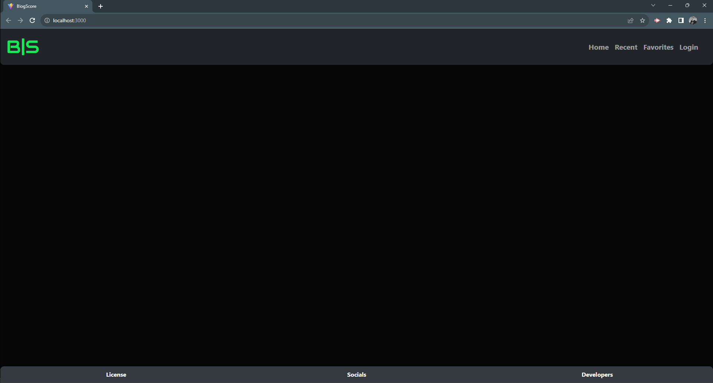
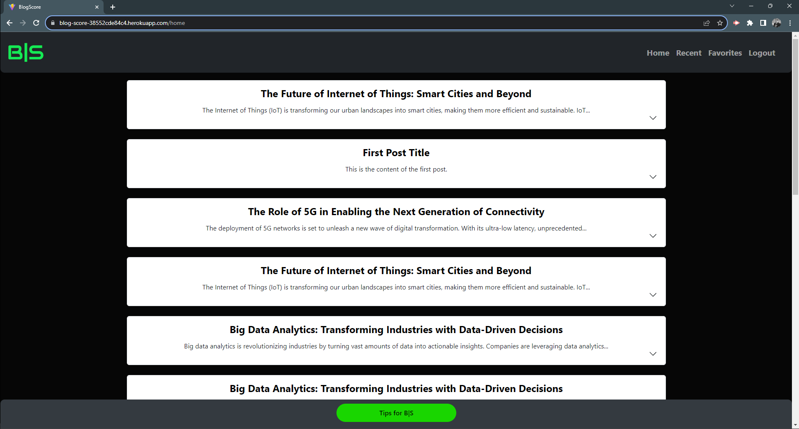
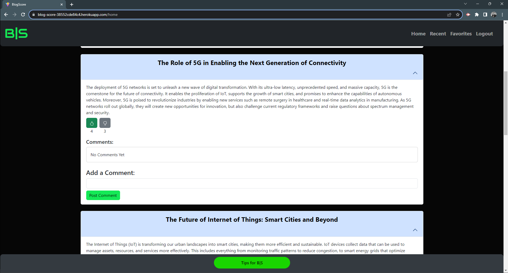
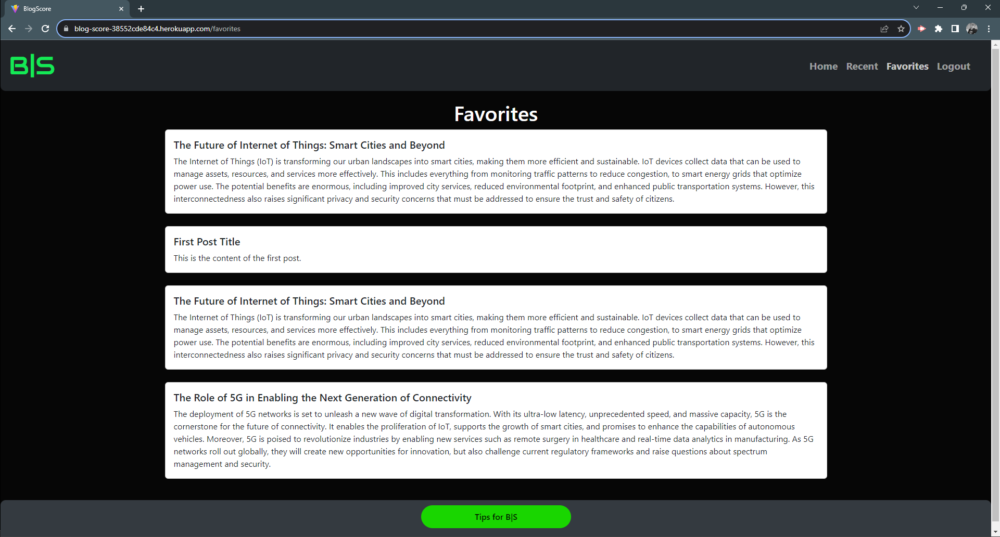

# Blog-Score

# Views



# Main View



# Expanded Main View



# Recently Viewed


# Recent Expanded View


# Favorites View



# Piggy Bank View


# OurMission

Welcome to Blog-Score, your go-to platform for curated content that perfectly aligns with your interests! At the heart of our service is a powerful custom recommendation engine designed to understand and anticipate user preferences. The meticulously organized file structure ensures the seamless integration of our recommendation engine, making it the backbone of a user-friendly experience!

## Table of Contents

- [Views](#views)
- [OurMission](#ourmission)
- [Installation](#installation)
- [WhyBlogScore](#whyblogscore)
- [FileNavigation](#filenavigation)
- [License](#license)
- [Contributing](#contributing)
- [Deployments](#deployments)
- [MeetTheDevs](#meetthedevs)

## Installation

Mobile application is currently deployed to Heroku

# WhyBlogScore?

### Intelligent Content Curation

Blog-Score stands out by leveraging cutting-edge technology to provide intelligent content curation. Nestled within the 'client' folder is our frontend architecture, housing components and utility functions. The 'src' directory encapsulates the dynamic duo - 'main.jsx' and 'app.jsx,' orchestrating an engaging user interface. Meanwhile, the 'utils' folder contains the brains behind the operation – 'auth.js,' 'mutations.js,' and 'queries.js,' all working in harmony to tailor content suggestions based on individual user behaviors.

### Robust Backend Architecture

Behind the scenes, the 'server' folder boasts a robust backend architecture. From 'config' to 'models' and 'schemas,' every element is meticulously structured. 'connection.js' in 'config' ensures a stable link to our database, while the 'models' directory stores essential data models like 'Comments.js,' 'Posts.js,' and 'User.js.' 'schemas' orchestrates GraphQL functionality through 'typeDef.js' and 'resolvers.js,' providing a seamless communication channel for our recommendation engine.

### Reliability and Scalability

Blog-Score isn't just about today; it's designed for the future. With a 'seeders' directory for initial data setup and 'utils' for essential functionalities like 'auth.js,' our backend is not just reliable but scalable. The entire system is neatly organized, facilitating easy maintenance and future enhancements. The carefully curated file structure isn't just for developers; it's a testament to our commitment to delivering a reliable, scalable, and continuously evolving platform for users who crave content that truly resonates with their interests.

### Future Developments and Features

The journey with Blog-Score doesn't end here. Looking ahead, we envision an even more dynamic platform with upcoming developments and features. Our roadmap includes enhanced personalization algorithms, expanded content categories, and integrations with emerging technologies. We're dedicated to staying at the forefront of technological advancements to continually elevate the user experience. As we evolve, your feedback and suggestions will play a crucial role in shaping the future of Blog-Score.

But Blog-Score isn't just about content; it's about community and engagement. Our developers have recently introduced an exciting, new upcoming feature – a "Support the Creators" button linked to a tip jar powered by Stripe. Soon users will be able to directly support their favorite creators, fostering a sense of community and appreciation for the incredible content on our platform. This innovation reflects our commitment to user engagement and the success of the creators who contribute to the Blog-Score community.

## FileNavigation

```
Blog-Score
|-- client
|   |-- src
|   |   |-- components
|   |   |   |-- [Component files]
|   |   |-- utils
|   |   |   |-- auth.js
|   |   |   |-- mutations.js
|   |   |   |-- queries.js
|   |   |-- app.jsx
|   |   |-- main.jsx
|-- server
|   |-- config
|   |   |-- connection.js
|   |-- models
|   |   |-- Comments.js
|   |   |-- index.js
|   |   |-- Posts.js
|   |   |-- User.js
|   |-- schemas
|   |   |-- index.js
|   |   |-- resolvers.js
|   |   |-- typeDef.js
|   |-- seeders
|   |   |-- seed.js
|   |-- utils
|   |   |-- auth.js
|   |-- package.json
|   |-- server.js
|-- .env
|-- .gitignore
|-- LICENSE
|-- package.json
|-- README.md
```

## License

This project is licensed under the MIT license.

## Contributing

Applications to join the B|S team can be directed to seanconnor22@gmail.com

## Deployments

- [See Us on Heroku](https://blog-score-38552cde84c4.herokuapp.com/)
- [Find Us on GitHub](https://github.com/Trifectice/blog-score)

## MeetTheDevs

- GitHub: [scsc22](https://github.com/scsc22)
- GitHub: [Trifectice](https://github.com/Trifectice)
- GitHub: [l-lavelle](https://github.com/l-lavelle)
- GitHub: [mHammy](https://github.com/mHammy)
- GitHub: [DntTstMe](https://github.com/DntTstMe)
  Checking if repo clone works
